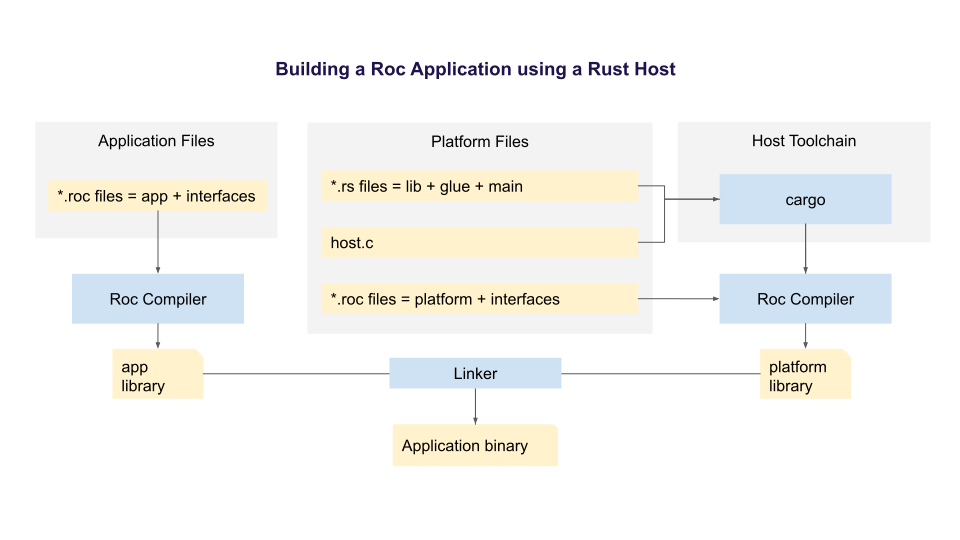
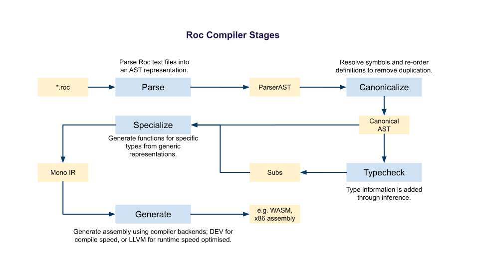

# Broc Internals

Broc has different rust crates for various binaries and libraries. Their roles are briefly described below. If you'd like to learn more, have any questions, or suspect something is out of date, please start a discussion on the [Broc Zulip](https://broc.zulipchat.com/)!

You can use `cargo doc` to generate docs for a specific package; e.g.

```
cargo doc --package broc_ast --open
```

## `ast/` - `broc_ast`

Code to represent the [Abstract Syntax Tree](https://en.wikipedia.org/wiki/Abstract_syntax_tree) as used by the editor. In contrast to the compiler, the types in this AST do not keep track of the location of the matching code in the source file.

## `cli/` - `broc_cli`

The `broc` binary that brings together all functionality in the Broc toolset.

## `cli_utils/` - `cli_utils`

Provides shared code for cli tests and benchmarks.

## `code_markup/` - `broc_code_markup`

A [markup language](https://en.wikipedia.org/wiki/Markup_language) to display Broc code in the editor.

## `compiler/`

Compiles `.broc` files and combines them with their platform into an executable binary. See [compiler/README.md](./compiler/README.md) for more information.

TODO explain what "compiler frontend" is
TODO explain what "compiler backend" is

The compiler includes the following sub-crates;
- `broc_alias_analysis` Performs analysis and optimizations to remove unneeded [reference counts](https://en.wikipedia.org/wiki/Reference_counting) at runtime, and supports in-place mutation.
- `arena_pool` An implementation of an [arena allocator](https://mgravell.github.io/Pipelines.Sockets.Unofficial/docs/arenas.html) designed for the compiler's workloads.
- `broc_build` Responsible for coordinating building and linking of a Broc app with its host.
- `broc_builtins` provides the Broc functions and modules that are implicitly imported into every module. See [README.md](./compiler/builtins/README.md) for more information.
- `broc_can` [Canonicalize](https://en.wikipedia.org/wiki/Canonicalization) a broc [abstract syntax tree](https://en.wikipedia.org/wiki/Abstract_syntax_tree), [resolving symbols](https://stackoverflow.com/a/1175493/4200103), [re-ordering definitions](https://www.oreilly.com/library/view/c-high-performance/9781787120952/546b5677-9157-4333-bc90-16db696436ac.xhtml), and preparing a module for [type inference](https://en.wikipedia.org/wiki/Type_inference).
- `broc_collections` Domain-specific collections created for the needs of the compiler.
- `broc_constrain` Responsible for building the set of constraints that are used during [type inference](https://en.wikipedia.org/wiki/Type_inference) of a program, and for gathering context needed for pleasant error messages when a type error occurs.
- `broc_debug_flags` Environment variables that can be toggled to aid debugging of the compiler itself.
- `broc_derive` provides auto-derivers for builtin abilities like `Hash` and `Decode`.
- `broc_exhaustive` provides [exhaustiveness](https://dev.to/babak/exhaustive-type-checking-with-typescript-4l3f) checking for Broc.
- `broc_fmt` The broc code formatter.
- `broc_gen_dev` provides the compiler backend to generate Broc binaries fast, for a nice developer experience. See [README.md](./compiler/gen_dev/README.md) for more information.
- `broc_gen_llvm` provides the LLVM backend to generate Broc binaries. Used to generate a binary with the fastest possible execution speed.
- `broc_gen_wasm` provides the WASM backend to generate Broc binaries. See [README.md](./compiler/gen_wasm/README.md) for more information.
- `broc_ident` Implements data structures used for efficiently representing small strings, like identifiers.
- `broc_intern` provides generic interners for concurrent and single-thread use cases.
- `broc_late_solve` provides type unification and solving primitives from the perspective of the compiler backend.
- `broc_load` Used to load a .broc file and coordinate the compiler pipeline, including parsing, type checking, and [code generation](https://en.wikipedia.org/wiki/Code_generation_(compiler)).
- `broc_load_internal` The internal implementation of broc_load, separate from broc_load to support caching.
- `broc_module` Implements data structures used for efficiently representing unique modules and identifiers in Broc programs.
- `broc_mono` Broc's main intermediate representation (IR), which is responsible for [monomorphization](https://en.wikipedia.org/wiki/Monomorphization), defunctionalization, inserting [ref-count](https://en.wikipedia.org/wiki/Reference_counting) instructions, and transforming a Broc program into a form that is easy to consume by a backend.
- `broc_parse` Implements the Broc parser, which transforms a textual representation of a Broc program to an [abstract syntax tree](https://en.wikipedia.org/wiki/Abstract_syntax_tree).
- `broc_problem` provides types to describe problems that can occur when compiling `.broc` code.
- `broc_region` Data structures for storing source-code-location information, used heavily for contextual error messages.
- `broc_target` provides types and helpers for compiler targets such as `default_x86_64`.
- `broc_serialize` provides helpers for serializing and deserializing to/from bytes.
- `broc_solve` The entry point of Broc's [type inference](https://en.wikipedia.org/wiki/Type_inference) system. Implements type inference and specialization of abilities.
- `broc_solve_problem` provides types to describe problems that can occur during solving.
- `test_derive` Tests Broc's auto-derivers.
- `test_gen` contains all of Broc's [code generation](https://en.wikipedia.org/wiki/Code_generation_(compiler)) tests. See [README.md](./compiler/test_gen/README.md) for more information.
- `test_mono` Tests Broc's generation of the mono intermediate representation.
- `test_mono_macros` Macros for use in `test_mono`.
- `broc_types` Various representations and utilities for dealing with types in the Broc compiler.
- `broc_unify` Implements Broc's unification algorithm, the heartstone of Broc's [type inference](https://en.wikipedia.org/wiki/Type_inference).

## `docs/` - `broc_docs`

Generates html documentation from Broc files.
Used for [roc-lang.org/builtins/Num](https://www.roc-lang.org/builtins/Num).

## `docs_cli/` - `broc_docs_cli` library and `broc-docs` binary

Provides a binary that is only used for static build servers.

## `editor/` - `broc_editor`

Broc's editor. See [README.md](./editor/README.md) for more information.

## `error_macros/` - `broc_error_macros`

Provides macros for consistent reporting of errors in Broc's rust code.

## `glue/` - `broc_glue`

The `broc_glue` crate generates code needed for platform hosts to communicate with Broc apps. This tool is not necessary for writing a platform in another language, however, it's a great convenience! Currently supports Rust platforms, and the plan is to support any language via a plugin model.

## `highlight/` - `broc_highlight`

Provides syntax highlighting for the editor by transforming a string to markup nodes.

## `linker/` - `broc_linker`

Surgical linker that links platforms to Broc applications. We created our own linker for performance, since regular linkers add complexity that is not needed for linking Broc apps. Because we want `broc` to manage the build system and final linking of the executable, it is significantly less practical to use a regular linker. See [README.md](./linker/README.md) for more information.

## `repl_cli/` - `broc_repl_cli`

Command Line Interface(CLI) functionality for the Read-Evaluate-Print-Loop (REPL).

## `repl_eval/` - `broc_repl_eval`

Provides the functionality for the REPL to evaluate Broc expressions.

## `repl_expect/` - `broc_repl_expect`

Supports evaluating `expect` and printing contextual information when they fail.

## `repl_test/` - `repl_test`

Tests the broc REPL.

## `repl_wasm/` - `broc_repl_wasm`

Provides a build of the REPL for the Broc website using WebAssembly. See [README.md](./repl_wasm/README.md) for more information.

## `reporting/` - `broc_reporting`

Responsible for generating warning and error messages.

## `broc_std/` - `broc_std`

Provides Rust representations of Broc data structures.

## `test_utils/` - `broc_test_utils`

Provides testing utility functions for use throughout the Rust code base.

## `tracing/` - `broc_tracing`

Provides tracing utility functions for various executable entry points.

## `utils/` - `broc_utils`

Provides utility functions used all over the code base.

## `vendor/`

These are files that were originally obtained somewhere else (e.g. crates.io) but which we needed to fork for some Broc-specific reason. See [README.md](./vendor/README.md) for more information.

## `wasi-libc-sys/` - `wasi_libc_sys`

Provides a Rust wrapper for the WebAssembly test platform built on libc and is primarily used for testing purposes.

# Building a Broc Application

Below is a simplified diagram to illustrate how a Broc application and host are combined to build an executable file. 



# Broc Compiler Stages

Below is a simplified diagram to illustrate the different stages of the Broc Compiler.


